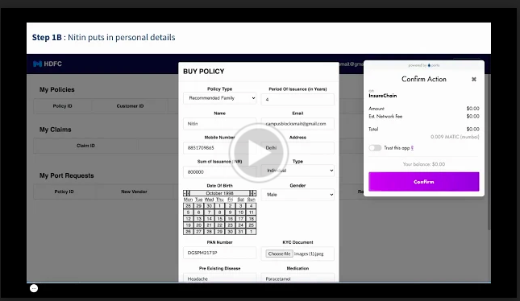

# M-Setu
M-Setu is a hybrid blockchain that enables seamless porting of the policies between different vendors, allowing interoperability and interaction between 
public and private Blockchain.

## Idea behind Insurechain
1. Public-Private Blockchain includes benefits of both the openness of a public blockchain and confidentiality of a private network by limiting the access to join a network
2. Private networks generate the record of transactions that are stored and verified on the public Blockchain. These help in faster transaction speeds, the privacy of the data.
3. M-Setu is a solution that allows any company to maintain a layer of privacy along with public verifiability of the transactions. 
4. This helps the enterprise get the scalability of transactions like private Blockchain by building on a sidechain by Polygon and validating transactions through a trust-minimized network using public checkpointing validators that finally commit it on Ethereum main chain to provide verifiable public proof.

# Problem Statement
There are two main problems which need to be solved:

1. Broken Process

The current process for porting insurance policies is time-consuming, expensive, and leads to data errors and ultimately loss of coverage for the customer. When customers move from one insurer to another, the entire data footprint, e.g., KYC docs, claims, medical docs, Etc., is created all over again. That means the process followed to port the policy is the same as creating a new policy. Therefore, it leads to increased costs and lead time, costs, and possible loss of cover for the customer if all the claims data cannot be produced at the new insurer. 

2. No Transparency or Accountability

Even if two insurers are willing to cooperate, there is no transparency in the process. No service level agreements (SLA) are enforced on porting the insurance, and government bodies like IRDAI will not have any visibility on the portal.

## Public Blockchain Architecture
The basic working architecture of the public Polygon Network chain can be studied here. However, here we take a step further and provide a proof-of-concept(POC) on the possibilities of using Polygon Network. Apart from the public sidechain, we can build an enterprise sidechain or optimistic rollup or any other sidechain that wants to interact with the existing public architecture of Polygon Network and benefit from the security provided by a public chain such as Ethereum.

### How Does it Work
1. A user does a normal transaction off-chain to an aggregator (block producer)
2. The transaction goes to the aggregator 
3. The aggregator bonds multiple user-transactions into a sidechain
4. The aggregator computes a new state root and creates an ethereum mainchain transaction, and publishes it

The significant advantage is that it batches transactions on-chain and reduces the cost of user transactions. In this approach, the data can remain confidential if required. However, the transaction data required for calling transactions is required. 

# Using Public Ledger versus Private Ledger
We have decided to use public ledgers to do the porting to reduce costs and increase security. That also prevents any particular insurer or government body from having disproportionate power or influence in this system. 
The PoC can be deployed using a permissioned ledger, but this will lead to centralization of power, where the body running the private infrastructure will have the power to add/remove nodes and thereby control which transactions are valid ones are not. That will ultimately defeat the purpose of using blockchain technology as this system would not be trust-minimized.

However, the public ledger used to build this system should have high performance and low cost per transaction to make the system viable. For this purpose, we have decided to use the Polygon Network public ledger as it supports 7200+ TPS at a transaction cost of less than $0.00003. 

# Technology used in the POC
The POC uses a Goerli chain and 2 Polygon proof of stake chains to simulate the insurance providers' porting mechanism. 

1. Public-Private Blockchain includes benefits of both the openness of a public blockchain and confidentiality of a private network by limiting the access to join a network
2. Private networks generate the record of transactions that are stored and verified on the public Blockchain. These help in faster transaction speeds, the privacy of the data.
3. M-Setu is a solution that allows any company to maintain a layer of privacy along with public verifiability of the transactions. 
4. This helps the enterprise get the scalability of transactions like private Blockchain by building on a sidechain by Polygon and validating transactions through a trust-minimized network using public checkpointing validators that finally commit it on Ethereum main chain to provide verifiable public proof.

## Insurance portability using public Blockchain
Ethereum, the world's first fully-fledged smart-contract platform, provides exciting propositions. Ethereum is leading the innovation in the public blockchain domain.
Decentralized application on Ethereum is making tremendous progress. However, the current blockchain ecosystem is not prepared to scale due to slow block confirmations and high gas fees.

Polygon Network solves the above problems by building a protocol for building and connecting Ethereum-compatible blockchain networks for faster and extremely low-cost transactions with commit on the Ethereum main chain.

The following things happen on the public Blockchain in the M-Setu Portal
1. Basic identifiable details of the customers
2. Basic identifiable details of the vendors
3. Metadata for NFTs\
  - Meta details of the policies.\
  - Details regarding the portability (When? from which vendor? to which vendor the policies were ported)
4. Claims\
   - Hashes of the claims

## Customer Journeys: Customer onboarding, Claims & Porting of Health Insurance
The user flow Diagram can be studied here.
1. Vendor 1 & Vendor 2 have their PPS commit chains which do
   - Customer onboarding
   - Claim Handling
   - Portability Handling
2. Consortium smart contract adding, which does
   - Interoperability between the vendors
   - Policy Transfers
The user flow Diagram can be studied here.

## Video Demo

## Conclusion

The Fourth Industrial Revolution will entirely depend on a few cutting-edge technologies.
This revolution will introduce new challenges as well as exciting opportunities. Tackling these challenges and exploiting the opportunity will solely rely on the practical usage of these Public Blockchains. 

Realizing the potential of public Blockchains M-Setu a policy creation and porting platform, is built as a PoC in partnership with Infosys.
The idea is to ease insurance policy creation and leverage public Blockchain to port insurance policies hassle-free.
